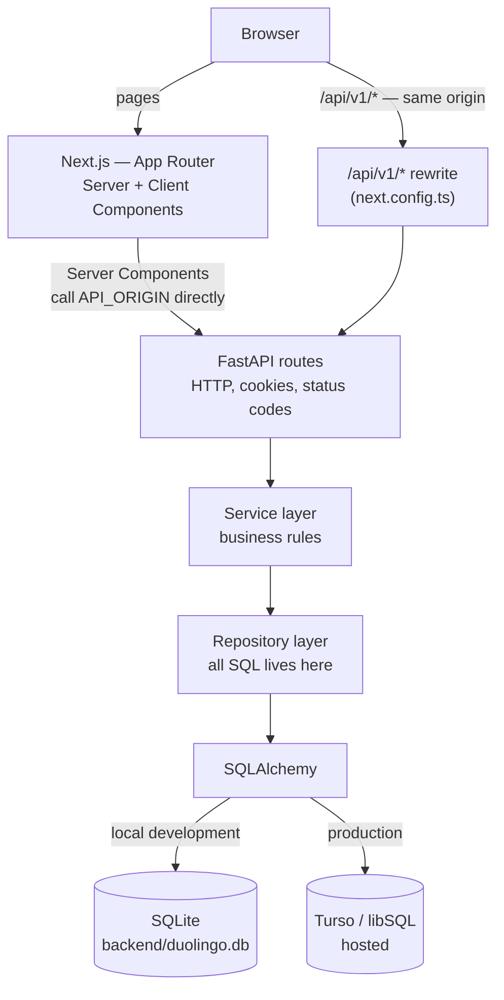
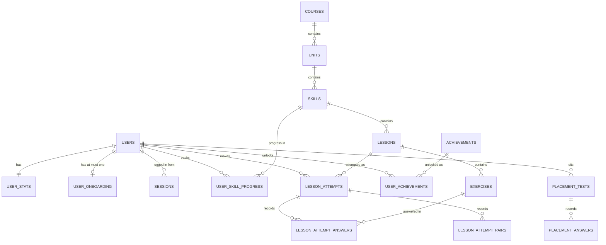
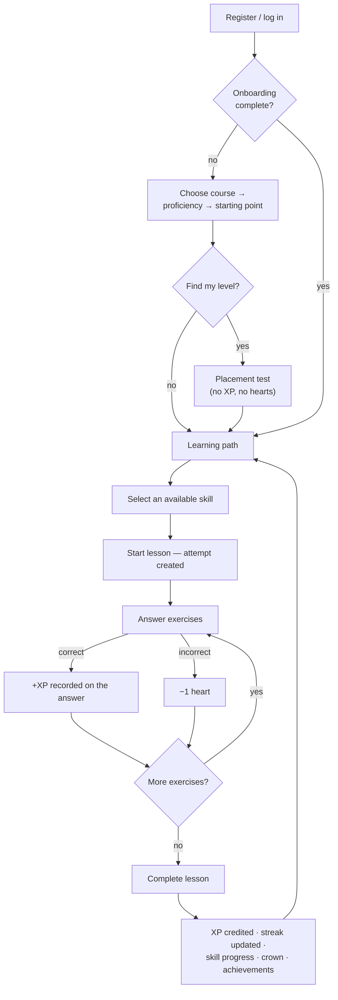
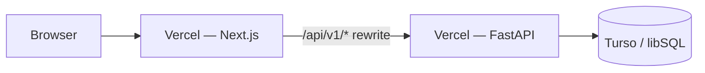

# Duolingo Web App

A full-stack Duolingo-inspired language learning web application built with
Next.js, TypeScript, FastAPI, SQLAlchemy, and SQLite/libSQL.

The application reproduces the core learning loop of a modern language-learning
product: a visual learning path of units and skills, a lesson player with five
interactive exercise types, and the gamification systems that sit around them —
XP, hearts, streaks, crowns, achievements and a leaderboard. It is designed to
closely reproduce the visual language, interaction patterns and core learning
loop of a Duolingo-style experience, over a single seeded Spanish course rather
than attempting to reproduce every feature of the product.

**All learning rules are enforced by the backend.** The browser renders exercises
and collects input; it never decides whether an answer is correct, how much XP it
is worth, or whether a skill is unlocked.

---

## Quick start

```bash
git clone https://github.com/advay-sinha/duolingo-clone.git
cd duolingo-clone

# --- backend (terminal 1) ---
cd backend
python -m venv .venv
.venv/Scripts/activate            # Windows;  source .venv/bin/activate on macOS/Linux
pip install -r requirements.txt
python -m app.db.migrate          # create the schema
python -m app.db.seed             # load the course + demo learner
python -m uvicorn app.main:app --reload --port 8000

# --- frontend (terminal 2) ---
cd frontend
npm install
npm run dev
```

Open **http://localhost:3000**. No configuration is required — the defaults point
the frontend at `http://localhost:8000` and create a local SQLite file at
`backend/duolingo.db`.

Sign in as the seeded learner with `learner@example.com` / `duolingo123`, or
register a new account and go through onboarding.

---

## Features

### Learning path

A vertical path of **units → skills → lessons**, rendered from a single API call.
Each skill node shows one of four states, all of them *derived* by the backend
rather than stored:

| State | Meaning |
|---|---|
| `LOCKED` | The previous skill has not been cleared |
| `AVAILABLE` | The first skill, or the previous one is cleared |
| `COMPLETED` | Every lesson in the skill is done — a crown was earned |
| `PLACED_OUT` | A placement test assessed the learner as past this material |

`COMPLETED` and `PLACED_OUT` both unlock what follows, but they are kept distinct
because they are different facts: one means the learner did the work, the other
means they never did. Placed-out skills stay playable.

Skill nodes show a progress ring, crown count and lesson counts.

### Lesson player

Five exercise types, all rendered from data and graded server-side:

| Type | Interaction |
|---|---|
| `MULTIPLE_CHOICE` | Pick one of several options |
| `TRANSLATE` | Build a sentence from a word bank |
| `MATCH_PAIRS` | Tap a term, then its meaning — graded **one pair at a time** |
| `FILL_BLANK` | Choose the word that completes a sentence |
| `TYPE_ANSWER` | Type a free-text translation |

The player provides immediate correct/incorrect feedback, a progress bar, a heart
counter, and a completion screen reporting XP, accuracy, streak and any
achievements unlocked. Progress is persisted per answer, so a dropped connection
cannot cost work already done.

Match pairs is graded incrementally: each pair is checked as it is formed, a
wrong pair costs one heart, and re-submitting the *same* wrong pair costs
nothing.

Answers are pronounced on demand using the browser's built-in
`SpeechSynthesis` API — no audio files and no third-party service.

### Gamification

All values below are configuration defaults in `backend/app/core/config.py`, not
literals scattered through the code.

| Rule | Behaviour |
|---|---|
| **XP** | +10 per correct answer, plus a lesson completion bonus (10 by default, per lesson). Recorded per answer, credited once at completion |
| **Repeat XP** | Replaying a completed lesson awards 0 — practice is allowed, farming is not |
| **Hearts** | Maximum 5, −1 per mistake. At 0, starting or answering a lesson returns 409 |
| **Heart regeneration** | One heart per 30 minutes, computed lazily on read — no scheduler |
| **Streak** | First activity → 1; same day → unchanged; next day → +1; a missed day resets to 1. `longest_streak` only rises |
| **Daily goal** | 30 XP, reset when the stored activity date is not today |
| **Crowns** | One per skill, awarded when every lesson in it is complete. The crown is what unlocks the next skill |
| **Leaderboard** | Ranked by lifetime XP, top 25 |

### Achievements

Six seeded achievements, evaluated on lesson completion inside the same
transaction:

| Achievement | Unlocked when |
|---|---|
| First steps | First lesson completed |
| Flawless | A lesson completed with no mistakes |
| Crowned | First skill crowned |
| Century | 100 total XP |
| On a roll | 3-day streak |
| Unstoppable | 7-day streak |

### Onboarding and placement

A newly registered learner chooses a course and a self-reported proficiency, then
either starts from the beginning or takes a **placement test**.

The placement test is real and data-driven: it draws questions from the seeded
course, treating position in the course as difficulty, and adapts — starting at
the middle band, moving one level harder on a correct answer and one easier on an
incorrect one, over 8 questions. The result maps to a starting skill, and the
skills before it are marked `PLACED_OUT`.

**Placement awards nothing.** No XP, no hearts spent, no streak, no achievements,
no lesson completion. It has its own tables and never creates a lesson attempt,
so a reward cannot leak into an assessment.

Learners who registered before onboarding existed skip it entirely.

### Learner profile

Identity, current stats (XP, hearts, streak, daily goal, gems), lifetime
aggregates (lessons completed, skills completed, crowns, perfect lessons), and
the achievement catalogue with unlock state.

### Authentication

**Local, session-cookie authentication** — deliberately not a full identity
platform.

- Passwords hashed with **bcrypt** (cost 12), never logged or serialised
- Sessions are **database rows**: an opaque 32-byte token in an `HttpOnly`
  cookie, its SHA-256 stored server-side, so logging out actually invalidates it
- `SameSite=Lax`, `Secure` in production, 14-day lifetime
- Identity always comes from the cookie — **no endpoint accepts a user id**
- Failed logins are rate limited: 5 per (email, IP) per 5 minutes, then 429

There is no OAuth, password reset, email verification, or role system. See
[Current scope](#current-scope-and-limitations).

---

## Tech stack

| Layer | Technology | Version |
|---|---|---|
| Frontend | Next.js (App Router) + React + TypeScript | 16.3.4 / 19.2.8 / 5.x |
| Styling | Tailwind CSS v4 (`@theme` design tokens) | 4.x |
| Backend | Python + FastAPI | 3.13 / 0.121.2 |
| Server | Uvicorn | 0.42.0 |
| ORM | SQLAlchemy 2.0 (declarative, synchronous) | 2.0.52 |
| Migrations | Alembic | 1.19.2 |
| Config | pydantic-settings | 2.13.1 |
| Password hashing | bcrypt | 5.0.0 |
| Database — local | SQLite (stdlib `sqlite3`) | — |
| Database — production | Turso / libSQL (`sqlite+libsql` dialect) | 0.2.0 |
| API | REST / JSON | — |
| Backend tests | pytest + FastAPI `TestClient` | 8.4.2 |
| Frontend tests | Node's built-in runner (`node --test`); Vitest + jsdom + Testing Library | — / 3.x |
| Deployment | Vercel (frontend and backend), Turso (database) | — |

**Runtime dependencies, in full:** the frameworks above plus `bcrypt`,
`alembic` and `sqlalchemy-libsql`. Sessions use `secrets` and `hashlib`, rate
limiting is a dictionary and a lock, audio uses the browser's `SpeechSynthesis`,
dark mode is CSS variables, and there is no state-management library on either
side.

---

## Architecture



**The browser only ever talks to one origin.** Next.js rewrites `/api/v1/*` to
the backend, which keeps the session cookie first-party and means there is no
cross-origin request for CORS to govern.

### Frontend

- **App Router** with deliberate server/client boundaries. Pages are Server
  Components that fetch data and pass it down; only interactive pieces
  (`"use client"`) ship JavaScript.
- **One HTTP module.** `lib/api/client.ts` is the only code that calls `fetch`;
  every feature module (`courses.ts`, `lessons.ts`, `auth.ts`, …) wraps it with
  typed functions. `lib/api/server.ts` forwards cookies for Server Components.
- **Pure logic is extracted and tested without a DOM** — the lesson session
  reducer, exercise narrowing, match-pair state, path presentation, the
  radio-group keyboard contract.
- **`proxy.ts`** redirects visitors with no session cookie away from protected
  routes. It is a user-experience optimisation, **not** the security boundary —
  the API is.

### Backend

Strict layering, each level knowing only about the one below:

| Layer | Directory | Responsibility |
|---|---|---|
| Routes | `app/api/v1/routes/` | HTTP only — receive, delegate, return. No rules |
| Schemas | `app/schemas/` | Request/response contracts, separate from the ORM |
| Services | `app/services/` | Business rules; own transactions; no HTTP, no SQL |
| Repositories | `app/repositories/` | Every `select()` in the codebase; never commit |
| Models | `app/models/` | Tables and constraints; no behaviour |

Services raise domain errors (`NotFoundError`, `ConflictError`, …) and a single
handler in `app/main.py` maps them to status codes, so **every error response has
the same shape**: `{"error": {"code", "message"}}`.

Two modules are deliberately **pure** — no database, no clock, no HTTP —
`services/grading.py` (five answer validators) and
`services/placement_engine.py` (the placement algorithm). They are the most
heavily tested code in the project.

### Database

Content and progress are separate concerns:

- **Content** (`courses → units → skills → lessons → exercises`) is shared and
  read-only at runtime.
- **Progress** (`user_stats`, `user_skill_progress`, `lesson_attempts`, …) is
  per learner.

Registering a learner therefore writes a handful of rows rather than copying a
course. Skill lock state is *derived*, never stored, so it cannot drift from the
progress it summarises.

---

## Project structure

```text
.
├── backend/
│   ├── alembic/                  migration environment + versions
│   ├── app/
│   │   ├── api/v1/
│   │   │   ├── deps.py           get_db, get_current_user
│   │   │   ├── router.py         aggregates every route module
│   │   │   └── routes/           health, auth, onboarding, placement,
│   │   │                         courses, lessons, leaderboard, users
│   │   ├── core/                 config, error envelope, rate limiting
│   │   ├── db/                   engine/session, migrate, seed, seed data
│   │   ├── models/               content, user, progress, achievement,
│   │   │                         onboarding, placement
│   │   ├── repositories/         all SQL
│   │   ├── schemas/              API contracts
│   │   ├── services/             grading, gamification, lesson/answer,
│   │   │                         auth, path, placement, achievements
│   │   └── main.py               app factory, CORS, error handlers
│   ├── tests/
│   ├── alembic.ini
│   ├── requirements.txt
│   └── .env.example
│
├── frontend/
│   ├── app/                      routes: /, /login, /register, /learn,
│   │                             /learn/lesson/[lessonId], /onboarding/*,
│   │                             /leaderboard, /profile
│   ├── components/
│   │   ├── auth/ shell/ learning-path/ lesson/ onboarding/
│   │   ├── leaderboard/ profile/
│   │   └── lesson/exercises/     the five exercise renderers
│   ├── lib/
│   │   ├── api/                  client, server, typed endpoint modules
│   │   ├── lesson/ learn/ onboarding/   pure logic
│   │   ├── a11y/ audio/ theme.ts
│   ├── next.config.ts            the /api/v1 rewrite
│   ├── proxy.ts                  cookie-presence redirect
│   └── .env.example
|
└── README.md
```

---

## Local development

### Prerequisites

| Tool | Version used |
|---|---|
| Python | 3.13 (3.11+ expected to work) |
| Node.js | 20+ (developed on 23.7) |
| npm | bundled with Node |

### Backend

```bash
cd backend
python -m venv .venv
.venv/Scripts/activate            # Windows
# source .venv/bin/activate       # macOS / Linux

pip install -r requirements.txt

python -m app.db.migrate          # create or update the schema
python -m app.db.seed             # idempotent — safe to re-run

python -m uvicorn app.main:app --reload --port 8000
```

Runs on **http://localhost:8000**. Interactive API docs at
**http://localhost:8000/docs**.

No `.env` file is needed. Copy `backend/.env.example` to `backend/.env` only if
you want to override something — and **leave `DATABASE_URL` commented**, or local
development will point at the wrong database.

### Frontend

```bash
cd frontend
npm install
npm run dev
```

Runs on **http://localhost:3000**. No environment file is needed; `API_ORIGIN`
defaults to `http://localhost:8000`.

### Running both

| Service | URL |
|---|---|
| Frontend | http://localhost:3000 |
| Backend | http://localhost:8000 |
| API docs | http://localhost:8000/docs |

The browser calls `http://localhost:3000/api/v1/*`, which Next.js rewrites to the
backend — the same path production uses, so the two environments do not diverge
in the area hardest to test.

---

## Environment variables

Nothing below is required for local development; every value has a working
default.

### Backend

| Variable | Required | Local default | Purpose | Secret |
|---|---|---|---|---|
| `ENVIRONMENT` | no | `development` | `development` / `test` / `production`. Production validates the settings below and refuses to start if they are unsafe | no |
| `DATABASE_URL` | production | `sqlite:///…/backend/duolingo.db` | The database. See [Database](#database) | **yes in production** (see note) |
| `TURSO_AUTH_TOKEN` | production | *(empty)* | Auth token for a hosted libSQL database | **yes** |
| `SESSION_COOKIE_SECURE` | production | `false` | Must be `true` over https, or the session cookie travels in the clear | no |
| `SESSION_COOKIE_NAME` | no | `duolingo_session` | Must match the frontend's | no |
| `SESSION_LIFETIME_DAYS` | no | `14` | Session validity | no |
| `BCRYPT_ROUNDS` | no | `12` | Password hashing cost (tests use 4) | no |
| `LOGIN_MAX_ATTEMPTS` | no | `5` | Failed logins per (email, IP) per window | no |
| `LOGIN_WINDOW_SECONDS` | no | `300` | Rate-limit window | no |
| `TRUST_PROXY_HEADERS` | no | `false` | Read `X-Forwarded-For`. **Only enable behind a proxy that overwrites it** | no |
| `CORS_ORIGINS` | no | localhost pair | Browser origins allowed to call the API directly. Empty in the same-origin deployment. Accepts a comma-separated list, a single origin, JSON, or empty. Never `*` | no |
| `DEMO_EMAIL` | no | `learner@example.com` | Seeded learner's login | no |
| `DEMO_USER_PASSWORD` | no | `duolingo123` | Seeded learner's password. Production refuses to start while this is the committed default | **yes in production** |
| `DATABASE_ECHO` | no | `false` | Log every SQL statement. Refused in production | no |

There is deliberately **no session secret**: session tokens are random bytes
stored as a digest and looked up, not signed, so there is no key to manage.

### Frontend

| Variable | Required | Local default | Purpose | Secret |
|---|---|---|---|---|
| `API_ORIGIN` | production | `http://localhost:8000` | Backend origin, as seen from the Next.js **server**. Used by the rewrite and by Server Components | no |
| `SESSION_COOKIE_NAME` | no | `duolingo_session` | Must match the backend's | no |

> **Build-time vs runtime.** `API_ORIGIN` is read by `next.config.ts` when the
> rewrite is compiled, so **changing it requires a new build**, not just a
> restart. It is deliberately not prefixed `NEXT_PUBLIC_`, so the backend's
> address is never inlined into the browser bundle.

---

## Database

### Local development and tests

**SQLite**, as a single file at `backend/duolingo.db`. This is the database the
schema and migrations are written for, and what the entire backend test suite
runs against — each test builds a throwaway database in a temporary directory, so
the suite never opens your development file.

### Production

**Turso / libSQL.**

```
Local        FastAPI → SQLAlchemy → SQLite (backend/duolingo.db)
Production   FastAPI → SQLAlchemy → Turso / libSQL
```

The application does not know which one it is talking to. The difference is one
environment variable naming a different driver:

```bash
# local
DATABASE_URL=sqlite:///…/backend/duolingo.db

# production
DATABASE_URL=sqlite+libsql://<db>-<org>.turso.io/?secure=true
TURSO_AUTH_TOKEN=<token>
```

Note the dialect — `sqlite+libsql`. SQLAlchemy still generates SQLite SQL, and
every model, repository, service and migration is unchanged.

### Why Turso/libSQL is used in production

SQLite is a file-based database and works well as one. The deployed backend runs
as a serverless function, whose filesystem is not a suitable persistent location
for a database file: it is read-only apart from a temporary directory, and that
directory is per-instance and discarded between invocations.

The backend was originally deployed with a SQLite file path, and the limitation
surfaced exactly as you would expect — the health endpoint returned 200 because
it runs no query, while the first endpoint that touched the database failed with
`unable to open database file`.

Turso/libSQL was selected because **libSQL is a fork of SQLite**: the same SQL
dialect, the same schema, the same semantics, but hosted and reached over the
network. That made it possible to keep FastAPI, SQLAlchemy, the relational
schema, the repositories, the services and the Alembic migrations exactly as they
were, rather than replacing the backend stack or migrating to a different
relational database.

**This is a deployment adaptation, not a change of architecture.** To be precise
about the wording:

> SQLite remains the local development and test database. Turso/libSQL is the
> production database backend.

The project can still be run entirely locally with SQLite, which is what the
Quick Start above does, and the SQLite-based tests remain the primary safety net.
The relational schema is SQLite-compatible in both environments.

### Schema

Seventeen tables, plus Alembic's version table.

| Table | Purpose |
|---|---|
| `users` | Learner accounts — unique email, bcrypt hash, unique display name |
| `sessions` | One logged-in browser; stores the SHA-256 of the token, never the token |
| `user_stats` | Current XP, hearts, streak, daily goal, gems — one row per learner |
| `courses` | A language pair |
| `units` | Themed groups of skills, ordered within a course |
| `skills` | Path nodes, ordered within a unit |
| `lessons` | One sitting; the unit of completion and XP award |
| `exercises` | One question; type-specific payloads in JSON |
| `user_skill_progress` | Lessons completed, crowns, XP and placed-out state, per learner per skill |
| `lesson_attempts` | History of lesson sessions |
| `lesson_attempt_answers` | One row per submitted answer |
| `lesson_attempt_pairs` | One row per match-pairs selection |
| `achievements` / `user_achievements` | The catalogue, and who has unlocked what |
| `user_onboarding` | Course, proficiency, starting point and placement result |
| `placement_tests` / `placement_answers` | Placement sittings and their graded answers |



Two design decisions worth knowing:

- **Skill state is derived, not stored.** There is no `is_locked` column; the
  path is computed from skill ordering plus crowns and placed-out state, so the
  two can never disagree.
- **Current state and history are separate.** `user_stats` answers "where am I
  now"; `lesson_attempts` answers "what happened". Totals are never recomputed by
  summing history.

### Migrations

Alembic, with a baseline representing the current schema.

```bash
cd backend
python -m app.db.migrate          # empty, legacy or already-managed — all handled
```

The command detects an empty database (creates the schema), a database predating
Alembic (repairs it, verifies it, then *stamps* it — recording the version
without running DDL), or one already managed (upgrades it). It never drops,
rewrites or deletes a row, and running it twice is a no-op.

Making a schema change:

```bash
alembic revision --autogenerate -m "what changed"
# review the generated file, then:
alembic upgrade head
```

---

## Seed data

```bash
cd backend
python -m app.db.seed
```

Idempotent — every entity is found by a natural key and only inserted if missing,
so re-running it changes nothing and never touches learner progress.

It creates:

| | |
|---|---|
| Course | 1 — Spanish, for English speakers |
| Units | 3 |
| Skills | 9 |
| Lessons | 18 (2 per skill) |
| Exercises | 90 (5 per lesson — one of each type) |
| Achievements | 6 |
| Demo learner | 1 — "Alex Mercer", 0 XP, 5 hearts, 30 XP daily goal |

All course content is original and written for this project.

The seed creates a single demo learner; **the leaderboard is populated by real
accounts**, not by fixture users, so it shows only learners who have actually
registered.

---

## API

All endpoints are under `/api/v1`. Interactive documentation, generated from the
Pydantic schemas, is at `/docs`.

Endpoints marked **session** require a valid session cookie and answer `401`
without one. **No endpoint accepts a user id** — identity always comes from the
cookie.

### Health

| Method | Path | Purpose |
|---|---|---|
| `GET` | `/api/v1/health` | Liveness. Runs no query — a 200 here says nothing about the database |

### Authentication

| Method | Path | Auth | Purpose |
|---|---|---|---|
| `POST` | `/api/v1/auth/register` | — | Create an account and start a session |
| `POST` | `/api/v1/auth/login` | — | Sign in (rate limited) |
| `POST` | `/api/v1/auth/logout` | — | Delete the session row and clear the cookie |
| `GET` | `/api/v1/auth/me` | session | The caller's identity |

### Onboarding

| Method | Path | Auth | Purpose |
|---|---|---|---|
| `GET` | `/api/v1/onboarding` | session | Which step the learner is on |
| `POST` | `/api/v1/onboarding/course` | session | Choose a course |
| `POST` | `/api/v1/onboarding/proficiency` | session | Record self-reported level |
| `POST` | `/api/v1/onboarding/start` | session | "Start from scratch" or "find my level" |

### Placement

| Method | Path | Auth | Purpose |
|---|---|---|---|
| `POST` | `/api/v1/placement/start` | session | Open or resume a placement test |
| `POST` | `/api/v1/placement/answer` | session | Grade one answer, return the next question |
| `POST` | `/api/v1/placement/complete` | session | Score the test and place the learner |

### Courses and path

| Method | Path | Auth | Purpose |
|---|---|---|---|
| `GET` | `/api/v1/courses` | — | List available courses |
| `GET` | `/api/v1/courses/{course_id}/path` | session | The full learning path with derived skill state |

### Lessons

| Method | Path | Auth | Purpose |
|---|---|---|---|
| `GET` | `/api/v1/lessons/{lesson_id}` | — | A lesson and its exercises — **never their answers** |
| `POST` | `/api/v1/lessons/{lesson_id}/start` | session | Open an attempt |
| `POST` | `/api/v1/lessons/{lesson_id}/answer` | session | Grade one answer |
| `POST` | `/api/v1/lessons/{lesson_id}/pair` | session | Grade one match-pairs selection |
| `POST` | `/api/v1/lessons/{lesson_id}/complete` | session | Settle XP, streak, crowns, achievements |

### Learner

| Method | Path | Auth | Purpose |
|---|---|---|---|
| `GET` | `/api/v1/users/me` | session | Identity |
| `GET` | `/api/v1/users/me/stats` | session | XP, hearts, streak, daily goal, gems |
| `GET` | `/api/v1/users/me/profile` | session | Identity, stats and lifetime aggregates |
| `GET` | `/api/v1/users/me/achievements` | session | The catalogue with unlock state |
| `GET` | `/api/v1/leaderboard` | session | Standings by lifetime XP |

---

## Core user flow



**Where state is persisted.** An attempt row is created at `start`. Each answer
writes a row immediately, carrying the XP it is worth and any heart lost — so
progress survives a dropped connection, and a resubmitted answer is recognised
and replayed rather than charged twice. Nothing is credited to `user_stats` until
`complete`, which writes the attempt, the stats and the skill progress in **one
transaction**. Completing a lesson twice returns `409` and awards nothing.

---

## Lesson engine

Lessons are entirely data-driven. An exercise row carries its type, a prompt and
two JSON payloads: `data` (everything the learner may see) and `correct_answer`
(the solution).

```
Lesson → Exercises → exercise.type
                       ↓
       frontend: narrowExercise() → discriminated union → renderer
                       ↓
       answer submitted (never a verdict)
                       ↓
       backend: grading.validate() → one of five pure validators
                       ↓
       answer row written → progress updated
```

**The canonical answer never reaches the browser.** The response schema simply
does not declare the field, so it cannot leak by accident. Option ordering is
also decoupled from the authored order at serialisation, so the answer cannot be
inferred from its position either.

Adding a sixth exercise type means: one enum value, one validator, one renderer,
one entry in the frontend's discriminated union — and TypeScript's exhaustiveness
checking makes the compiler point at the places that need updating. No change to
the lesson engine, the attempt model or the API.

---

## Design

The interface follows a playful, tactile visual language built from a token
system in `frontend/app/globals.css`:

- **Design tokens** — brand colours each paired with a darker "depth" tone,
  thirteen semantic type sizes, and layout measurements, declared in a Tailwind
  v4 `@theme` block so components never hard-code a hex value.
- **Tactile controls** — a 2px outline plus a thick bottom border in the depth
  tone, which collapses on press, giving buttons a physically extruded feel
  rather than a blurred drop shadow.
- **Rounded cards, strong typography** — body weight never drops below 600.
- **Colourful feedback** — green and red feedback grounds with dedicated
  high-contrast text tokens.
- **Progress indicators** — a lesson progress bar, skill progress rings, a daily
  goal bar and an onboarding rail.
- **Celebratory states** — a completion screen with a pop-in animation and an
  achievement callout.
- **Mascot** — the owl is drawn as inline SVG that takes its colours from the
  design tokens, rather than shipped as a bitmap.

The repository includes Stitch-generated design references, which were used as
the visual source of truth; the values taken from them (the palette, the type
scale, the component shapes) live in the token block and in reusable components,
so the design references are not part of the build.

**Dark mode** is implemented across every screen with a Light / Dark / System
toggle, applied by an inline script before hydration so there is no flash of the
wrong theme and no hydration mismatch.

---

## Testing

```bash
# backend
cd backend && .venv/Scripts/python.exe -m pytest

# frontend
cd frontend
npm test                 # pure-logic + component tests
npm run test:unit        # pure logic only (node --test)
npm run test:components  # components only (vitest)
npx tsc --noEmit         # type check
npm run lint             # eslint
npm run build            # production build
```

Three layers, split deliberately:

| Layer | Tool | Covers |
|---|---|---|
| Pure logic | `node --test` on `.ts` | Reducers, payload builders, exercise narrowing, match-pair state, the radio-group keyboard contract, the API client. No DOM |
| Components | Vitest + jsdom + Testing Library on `.tsx` | What a learner sees and can do — which control appears, what a click reports, what a key press selects |
| API | pytest + FastAPI `TestClient` | Status codes, shapes, ownership, idempotency, transactions, migrations, configuration, and the answer-leak guarantees |

Every backend test builds a throwaway SQLite file in pytest's temporary
directory and seeds it with the same `seed()` function the command uses, so **the
suite never opens `backend/duolingo.db`**. The suite also logs in through the
real `POST /auth/login` rather than stubbing the current-user dependency, so
every test exercises the cookie and session lookup as a side effect.

At the time of writing: **430 backend tests, 130 frontend unit tests and 97
component tests** pass, with `tsc`, `eslint` and `next build` clean.

---

## Deployment

| Component | Host |
|---|---|
| Frontend | Vercel |
| Backend | Vercel (Python serverless function) |
| Database | Turso / libSQL |



The browser sees a single origin. `next.config.ts` rewrites `/api/v1/*` to
`API_ORIGIN`, which keeps the session cookie first-party and removes the need for
CORS entirely — a `SameSite=Lax` cookie is not sent on cross-site requests, so a
split-origin deployment would break authentication while leaving server-rendered
pages working.

### Deploying

**Backend** — set the environment variables:

```
ENVIRONMENT=production
DATABASE_URL=sqlite+libsql://<db>-<org>.turso.io/?secure=true
TURSO_AUTH_TOKEN=<token>
SESSION_COOKIE_SECURE=true
TRUST_PROXY_HEADERS=true
CORS_ORIGINS=
DEMO_USER_PASSWORD=<your own>
```

Production validates these at startup and **refuses to boot** if the cookie is
insecure, the demo password is still the committed default, SQL echo is on, the
CORS list still contains localhost, or a libSQL URL is configured without a
token. Each of those is a mistake that is otherwise silent.

**Database** — create the Turso database and load the schema:

```bash
turso db create duolingo
turso db show duolingo --url          # → libsql://…  (see the note below)
turso db tokens create duolingo       # → TURSO_AUTH_TOKEN
```

> **Two details that are easy to get wrong.**
>
> 1. The CLI prints `libsql://…`, but SQLAlchemy needs **`sqlite+libsql://…`** —
>    libSQL is a *dialect of sqlite*, so the URL must name both.
> 2. The token goes in **`TURSO_AUTH_TOKEN`**, not in the URL. The driver takes
>    it as a connect argument and never reads it from the query string.
>
> The application detects both mistakes at startup and reports what to change.

**Frontend** — set `API_ORIGIN` to the backend's URL, then deploy. Because the
rewrite is compiled at build time, changing `API_ORIGIN` requires a **new
deployment**, not just a restart.

### A note on SQLite and serverless

SQLite is file-based and works well for local development, but a serverless
function filesystem is not a suitable persistent location for a database file —
it is read-only apart from a temporary directory, and that directory is
per-instance and discarded between invocations. The production deployment
therefore uses Turso/libSQL, a hosted SQLite-compatible database. This preserves
the application's relational schema and SQLAlchemy-based persistence model while
providing durable storage.

This is a statement about *where a database file can live*, not a claim that the
platform is incapable of running the application — FastAPI itself runs there
without modification.

---

## Security and configuration

Implemented:

- **Passwords** hashed with bcrypt; never logged, and no response model declares
  the field, so a hash cannot be serialised by accident.
- **Sessions** are server-side rows; logging out deletes the row rather than only
  clearing the cookie.
- **Cookies** are `HttpOnly` (unreadable by JavaScript), `SameSite=Lax`, `Secure`
  in production, scoped to `/`.
- **Identity** comes only from the session cookie; no endpoint accepts a user id,
  so cross-user access is not a check that can be forgotten.
- **Rate limiting** on failed logins, with an identical response whether or not
  the email exists.
- **Secrets** live in environment variables. Nothing secret is committed;
  `.env` files are gitignored and `.env.example` documents the keys with
  placeholders.
- **CORS** is an explicit allowlist and can never be `*` — a wildcard origin and
  credentialed requests are incompatible.
- **Errors** use one envelope, including unhandled exceptions; no stack trace,
  SQL, filesystem path or request payload reaches a client.
- **Answer protection**: canonical answers are absent from response schemas and
  option ordering is decoupled from the authored order.

Not implemented, and not claimed: CSRF tokens (the same-origin deployment relies
on `SameSite`), password reset, email verification, account lockout, audit
logging, or multi-factor authentication.

---

## Current scope and limitations

Intentionally simplified or out of scope:

| Area | Status |
|---|---|
| Speech **recognition** | Not implemented. Text-to-speech pronunciation *is* implemented, using the browser's `SpeechSynthesis` |
| Shop / gems | The nav item is rendered disabled. `gems` exists on the stats model and is displayed, but nothing awards or spends it — it is initialised to 0 and stays there |
| Purchases, subscriptions | Not implemented |
| Friends / social features | Not implemented |
| Multiple courses | One seeded course. The picker shows other languages as clearly-labelled "Coming soon" tiles that are not selectable and have no backend rows |
| Leaderboard leagues / weekly periods | Lifetime XP only |
| Password reset, email verification, OAuth | Not implemented |
| Horizontal scaling | SQLite/libSQL is single-writer, and login rate limiting is per process |

The core learning loop — path, lessons, grading, XP, hearts, streaks, crowns,
achievements, leaderboard, profile, onboarding and placement — is fully
functional and backed by tests.

---

## Assumptions and trade-offs

| Decision | Reasoning |
|---|---|
| **SQLite locally, Turso/libSQL in production** | Keeps the relational, SQLite-oriented model everywhere; the production environment cannot host a database *file* |
| **FastAPI + SQLAlchemy** | Typed request/response validation and generated OpenAPI docs; a mature ORM with a real migration story |
| **Service / repository separation** | Business rules stay free of SQL and HTTP. The clearest payoff: adding real authentication changed one function body and no route, service or schema |
| **REST/JSON over GraphQL** | The client's data needs are known and few; GraphQL would add a schema layer for no benefit here |
| **Session rows over JWTs** | A signed token cannot be revoked, so logout would either do nothing server-side or need a revocation list — which is a session table with extra steps |
| **Derived skill state** | A stored `is_locked` flag would be a second copy of what crowns already imply, and the two can drift |
| **Seeded course content** | 90 original exercises are enough to exercise every code path; authoring more is content work, not engineering |
| **Local authentication** | Enough to make the app genuinely multi-user; a full identity platform is a separate product |
| **No microservices, queues or caches** | A single-process monolith with two deployables is the right size for this application |

---

## Developer documentation

[`docs/CODEBASE_LEARNING.md`](docs/CODEBASE_LEARNING.md) is the project's
architecture and implementation documentation. It goes considerably deeper than
this README, covering:

- a file-by-file guide explaining why each module exists and what it owns
- runtime request flows, as sequence diagrams
- the database design, constraints and indexing decisions
- the lesson engine, gamification rules and placement algorithm in detail
- an architecture decision log recording the options considered and rejected
- an implementation changelog
- deployment post-mortems and the debugging techniques that resolved them

---

## Original work

This is an original implementation inspired by the product experience of a
well-known language-learning application. All application code, course content
and design tokens in this repository were written for this project; no source
code was copied from existing implementations. Product names and trademarks
belong to their respective owners.
